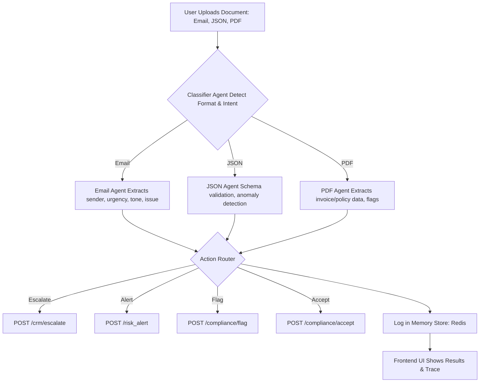
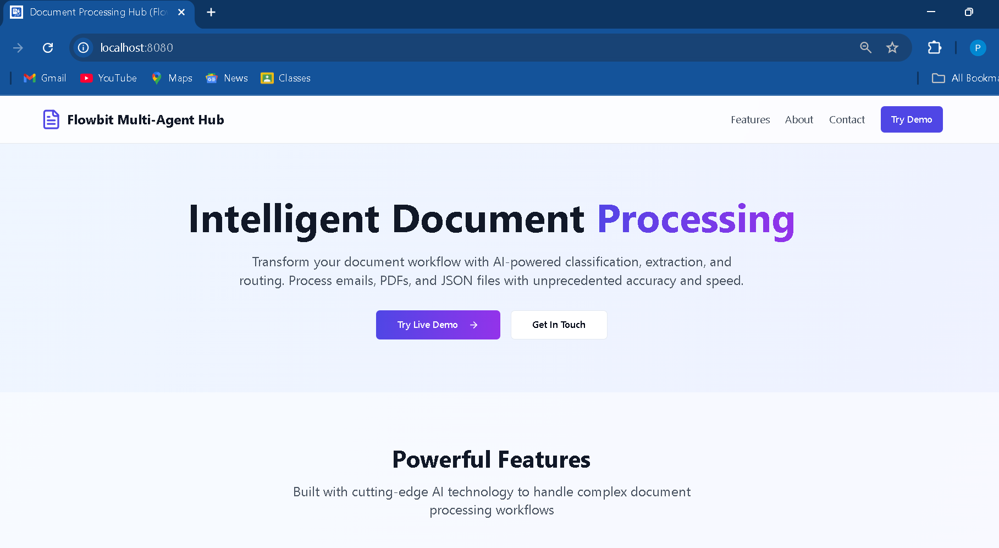
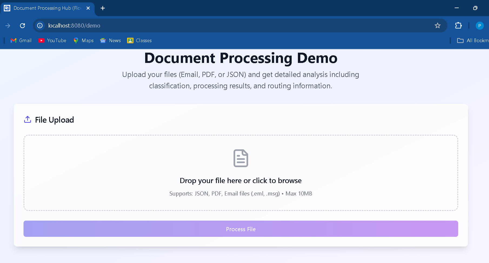
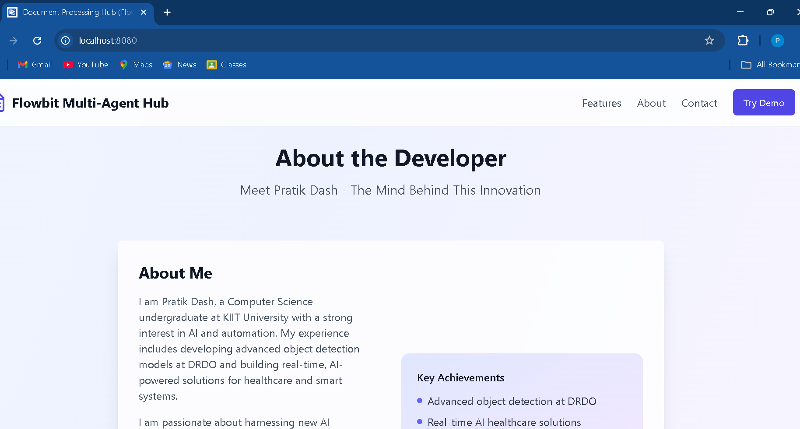
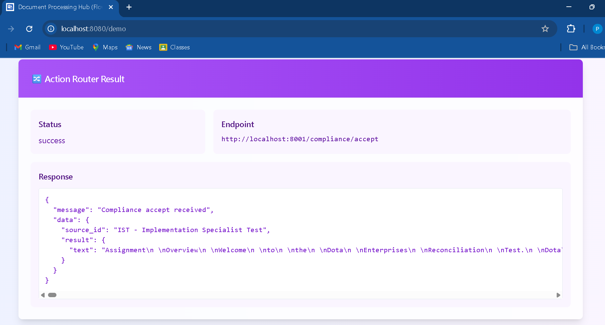

# Flowbit Multi-Agent Document Processing System


An AI-powered **multi-agent document processing system** that classifies, extracts, and routes business documents using **LLM intelligence and automated workflows**.

---

# Table of Contents

* Overview
* Features
* Tech Stack
* Gemini API Integration
* Project Structure
* System Architecture
* Frontend
* Backend
* Usage
* Dockerization
* Architecture Diagram
* How It Works
* Sample Screenshots
* License
* Author

---

# Overview

Flowbit is an **AI-powered, multi-format document processing system** that classifies, extracts, and routes business documents such as Emails, JSON files, and PDFs.

It features a **modular multi-agent architecture**, **LLM-enhanced intelligence**, **automated action routing**, and **full auditability**.

---

# Features

* Multi-format document classification (Email, JSON, PDF)
* Business intent detection (RFQ, Complaint, Invoice, Regulation, Fraud Risk)
* Specialized agents for Email, JSON, and PDF
* Automated action routing with retry logic
* Shared memory store for audit and traceability
* Modern React-based frontend for file upload and result display
* Dockerized backend and frontend for deployment

---

# Tech Stack

**Backend**

* Python
* FastAPI
* LangChain
* Redis
* Google Gemini API

**Frontend**

* React
* Vite (custom UI)

**Containerization**

* Docker

---

# Gemini API Integration

This project uses the **Google Gemini API** to power large language model (LLM) capabilities for document classification and intent detection.

Model used:

```
gemini-2.0-flash
```

### How it's used

1. The **Classifier Agent** sends document content to Gemini using a prompt with few-shot examples.
2. Gemini returns the predicted intent or label.
3. The system routes the document to the appropriate specialized agent.

This enables **context-aware classification** for:

* Emails
* JSON documents
* PDFs

### Example Gemini API usage

```python
from google import genai

client = genai.Client(api_key="YOUR_API_KEY")

response = client.models.generate_content(
    model="gemini-2.0-flash",
    contents="Classify this document: ..."
)

print(response.text)
```

For more information see:

https://ai.google.dev/gemini-api/docs

---

# Project Structure

```
multi-agent-system/
├── agents/
├── core/
├── frontend/
│   ├── public/
│   ├── src/
│   ├── package.json
├── main.py
├── requirements.txt
├── .env
└── README.md
```

---

# System Architecture

Flowbit follows a **modular multi-agent architecture**.

Documents are first classified and then routed to specialized agents that perform domain-specific extraction.

Each agent produces structured results that are passed to the **Action Router**, which triggers automated workflows and logs events.

### Architectural Principles

* Modular **agent-based processing**
* **LLM-powered classification**
* Shared **memory store for traceability**
* **Scalable API-based architecture**
* Complete **audit logging**

---

# Frontend

The frontend is a **React application** providing a clean UI for uploading documents and displaying results.

Displayed results include:

* Document classification
* Urgency detection
* Tone analysis
* Extracted information
* Action router decisions
* Full trace logs

Additional features:

* Custom favicon and branding
* Recruiter-friendly UI
* Clear visualization of multi-agent pipeline results

### Running the Frontend

1. Navigate to the frontend folder

```
cd frontend
```

2. Install dependencies

```
npm install
```

3. Run development server

```
npm run dev
```

4. Open the UI

```
http://localhost:5173/demo
```

---

# Backend

The backend is built using **FastAPI** and runs the entire multi-agent pipeline.

### Running the Backend

Create a virtual environment

```
python -m venv venv
```

Activate environment

```
venv\Scripts\activate
```

Install dependencies

```
pip install -r requirements.txt
```

Set environment variables in `.env`

Run the server

```
uvicorn main:app --reload
```

---

# Usage

1. Upload documents through the frontend UI.

2. The backend pipeline performs:

* Classification
* Agent-based extraction
* Action routing

3. Results are returned and displayed in the frontend dashboard.

---

# Dockerization

The project supports **Docker deployment** for both frontend and backend services.

Benefits:

* Easy environment setup
* Consistent deployment
* Simplified containerized architecture

---

# Architecture Diagram



> The **Classifier Agent leverages the Gemini API** for intelligent document classification.

---

# How It Works

### 1. Document Upload

The user uploads:

* Email
* JSON
* PDF

via the frontend UI.

---

### 2. Classifier Agent

Responsibilities:

* Detect document format
* Identify business intent

Uses:

* Schema matching
* Gemini LLM prompting
* Fallback rules

Routing metadata is stored in the **memory store**.

---

### 3. Specialized Agents

**Email Agent**

Extracts:

* Sender
* Subject
* Urgency
* Tone
* Issue or request

Determines whether escalation is required.

---

**JSON Agent**

Responsibilities:

* Schema validation
* Detect Invoice or RFQ structures
* Flag anomalies such as missing fields or incorrect data types.

---

**PDF Agent**

Extracts:

* Invoice details
* Line item information
* Compliance mentions such as GDPR or FDA.

Flags invoices above defined thresholds.

---

### 4. Action Router

Based on agent outputs, the system triggers actions:

* CRM escalation
* Compliance flagging
* Risk alerts
* Acceptance workflows

Includes **retry logic** for reliability.

---

### 5. Memory Store and Logging

All events are logged in two places:

**Redis**

* Fast retrieval
* Agent chaining
* Workflow memory

**File Logs**

```
logs/processing.log
```

Used for:

* Debugging
* Audit tracking
* Compliance records

---

### 6. Frontend Visualization

The UI displays:

* Document classification
* Agent outputs
* Action router responses
* Full trace logs

Designed to clearly show the **entire multi-agent pipeline**.

---

# Sample Screenshots

| Landing Page                 | Upload Section                 |
| ---------------------------- | ------------------------------ |
|  |  |

| About Developer                       | Result Output                 |
| ------------------------------------- | ----------------------------- |
|  |  |

| Action Router Output             |
| -------------------------------- |
|  |

---

# License

MIT

---

# Author

**Pratik Dash**
